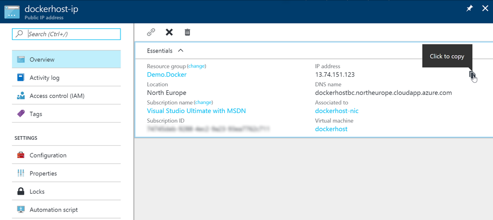

# Screenshots of Azure resource group after deployment

## How to find the public IP address of your Docker host

Click into Resource Groups (the blue cube icon on the right-hand toolbar), then navigate into the resource group created when you ran the `docker-machine` command (it will have a different name from this screenshot)

Click on the "Public IP" resource, from there you can find the IP address

