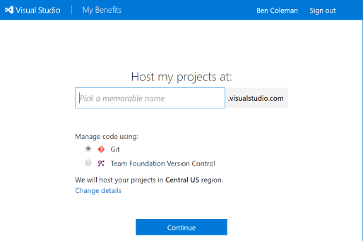
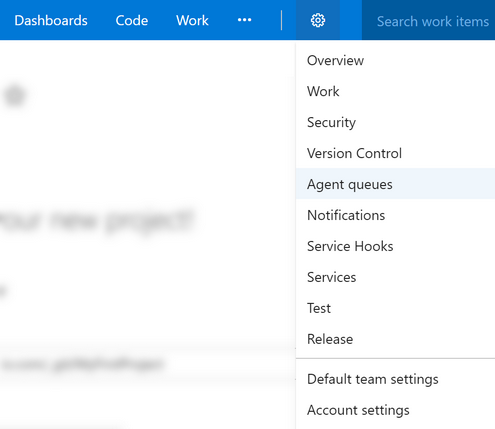
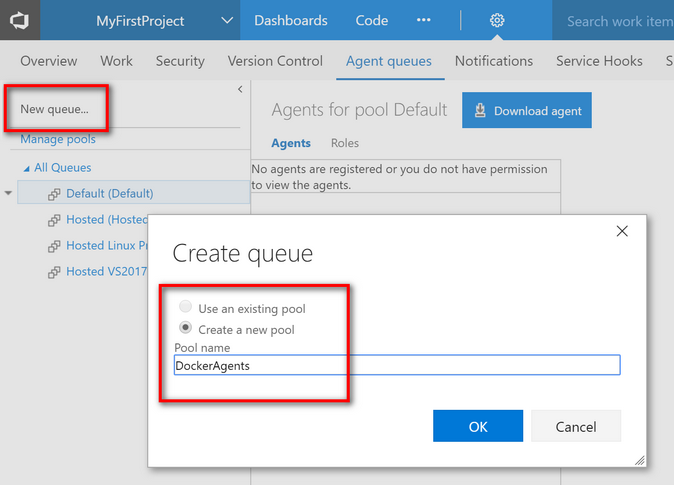
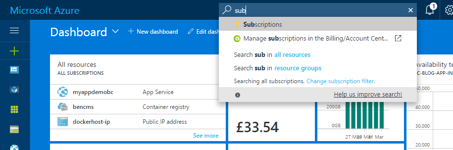
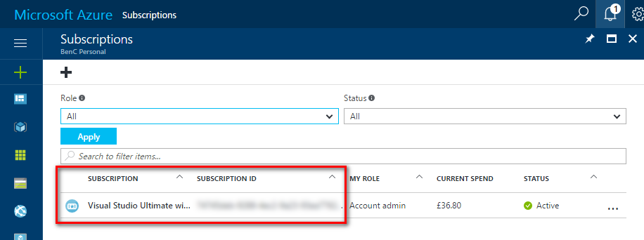
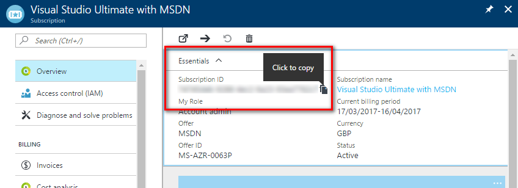
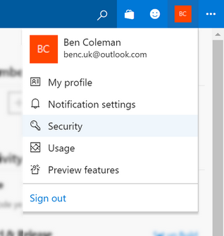
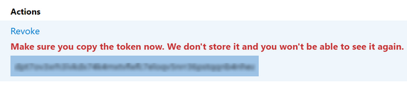
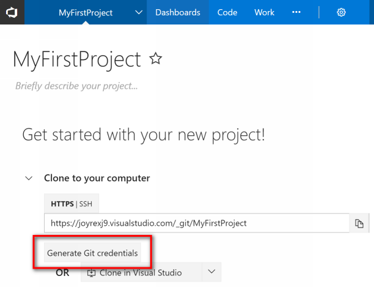

# Initial Setup Steps for Azure DevOps Lab with .NET Core, Docker and VSTS

These are more detailed steps with screenshots

## 1. Creating a new VSTS account / project
 * Choose a unique name for your account, make sure you choose git to manage your code: 
 
 * If you just created a new VSTS account, it will automatically create a project called "MyFirstProject" 
so you can use that


## 2. Create a custom VSTS agent pool & queue
 * In VSTS, click the settings cog and go into 'Agent queues'.  
 
 * Click on the hard to find 'New queue...' button, and create a queue called ***DockerAgents***
 


## 3. Make a note of your Azure subscription id
 * Log into the Azure portal [https://portal.azure.com](https://portal.azure.com)
 * Search for "subscriptions" (or just "sub") in the search bar  
 
 * Click on your subscription in the list  
 
 * In the 'Essentials' view your subscription ID will be shown along with a way to quickly copy it  
 
 

## 4. Create a PAT in VSTS
 * Go into your profile security settings  
 
 * Click 'Add' in the 'Personal access tokens' page  
 
 * Create a new token, the name doesn't matter, and leave scope as "All".  
 Once the token is created will get one chance to copy it, so paste it somewhere safe
 

## Optional - Creating git credentials
 * If you are not using the git credential manager you will need git credentials. From your new account/project page click 'Generate Git credentials'  
 


## Fooo

 * Create a VSTS agent pool: Settings -> Agent queues -> Manage pools -> New pool. Call it: **DockerAgents**
 * Make a note of your Azure subscription id (see below)
 * Make a note of your VSTS account name, `{acct_name}.visualstudio.com` (see below)
 * Create a VSTS PAT (personal access token) with a 1 year expiry [Details](https://www.visualstudio.com/en-us/docs/setup-admin/team-services/use-personal-access-tokens-to-authenticate)
 * If you've never run git before, run these commands (modifying with your details as required):
 ```
  git config --global user.email "you@example.com"
  git config --global user.name "Your Name"
```