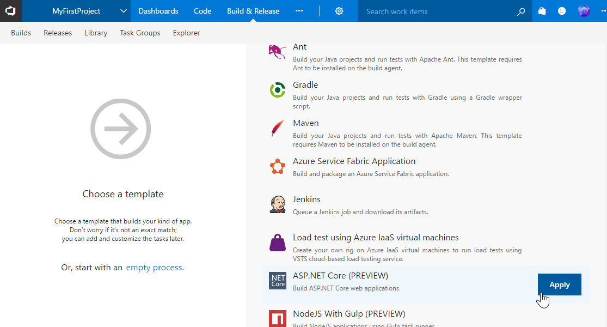
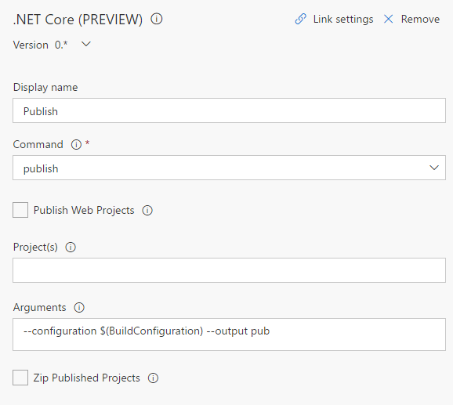
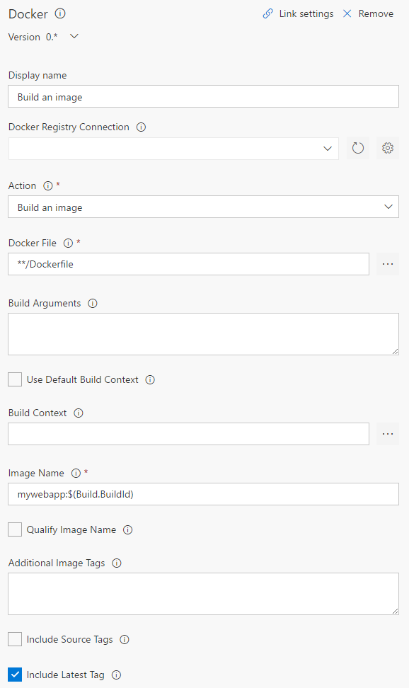
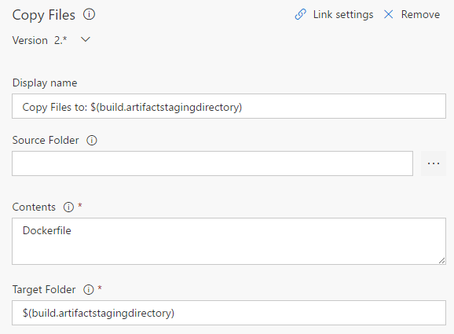
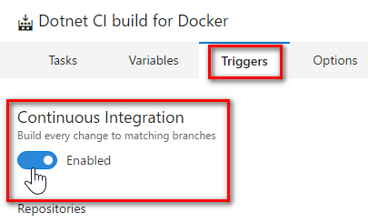
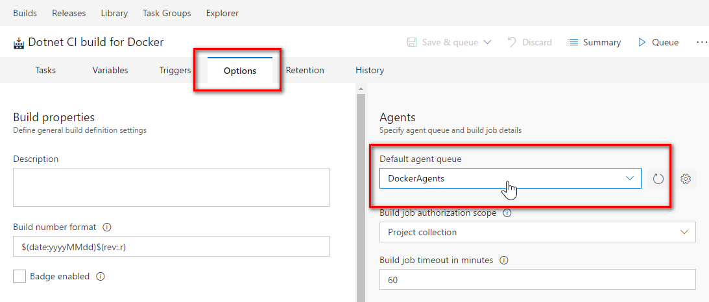
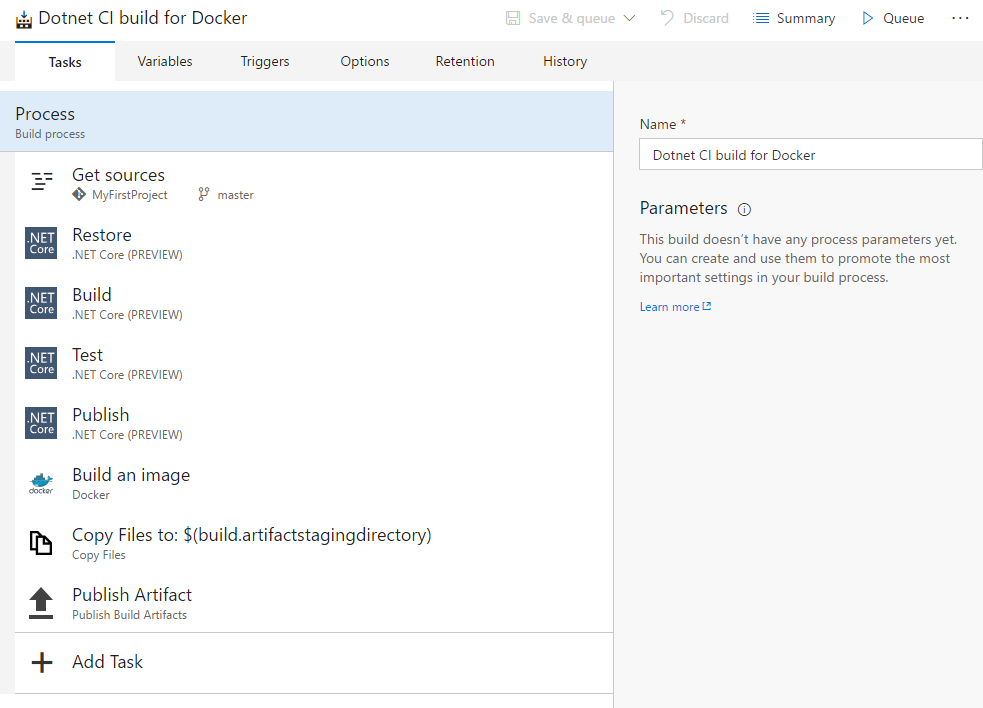

# Screenshots of the VSTS build steps

### Creating the new build definition 

---

### Build definition - .NET Core Publish task

---

### Build definition - Docker build image task

---

### Build definition - Copy files task

---

### Build definition - Enable CI

---

### Build definition - Change default agent queue

---

### Build definition - Completed
